# homeassistant.koplugin

<p align="center">
  Jump to the <a href="#installation">[Installation]</a>, <a href="#configuration">[Configuration]</a> or <a href="#examples">[Examples]</a> section
</p>

<p align="center">
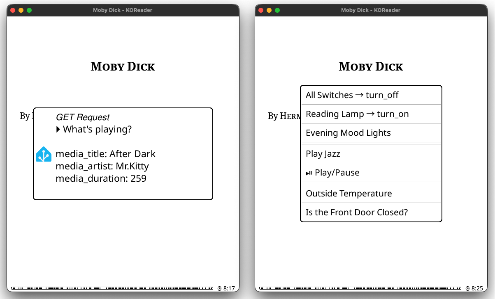
  <i>homeassistant.koplugin: a template query [left] & QuickMenu gesture [right]</i>
</p>

## Features

- Control any number of Home Assistant entities from KOReader 
- Action support with custom data attributes e.g.:  
  - **light.turn_on** with `brightness` and `color` 
  - **media_player.play_media** with `media_content_id` & `type`
- Actions with response data (currently **todo.get_items**)
- Evaluate Home Assistant templates
- Advanced targeting: single/multiple entities, areas or labels
- Entity state queries with customizable attributes e.g.:
  - **sensor.temperature_outside**: `state`, `unit_of_measurement`
- Lightweight, unobtrusive interface  
- Simple text-based configuration  
- Success/error notifications

## Installation

### Step 1: Download the Plugin
[Download the latest release](https://github.com/moritz-john/homeassistant.koplugin/releases) and unpack `homeassistant_koreader_plugin.zip`:  

### Step 2: Edit `config.lua`

Follow the [Configuration](#configuration) section.

Tip: You can install and configure the plugin in KOReader for macOS or Linux first. This makes it easier to fix configuration errors before copying the files to your e-reader.

> [!warning]
> Be aware of proper indentation, `{}` and `,` otherwise you will get syntax errors

### Step 3: Copy Files to Your Device

After editing `config.lua`, copy the files to your KOReader device:

* **Copy the entire `homeassistant.koplugin` folder into `koreader/plugins/`**  
* Optional: Copy the `icons` folder to `koreader/`  
  _Replaces the default “ⓘ” InfoMessage icon with the Home Assistant icon._  
  _Visual change only; does not affect plugin functionality._

### Step 4: Restart KOReader

The plugin appears under **Tools → Page 2 → Home Assistant** or can be called from KOReader [gestures](#koreader-gestures).

## Configuration

All configuration lives in `config.lua`.  
It consists of **connection settings** and a list of **entries** (Home Assistant entities).

### Connection Settings

First, add your Home Assistant connection details.  
Change `host`, `port`, and `token` according to your personal setup:

```lua
return {
    host = "192.168.1.10",
    port = 8123,
    token =
    "PasteYourHomeAssistantLong-LivedAccessTokenHere",
```

> [!tip]
> **How to create a Long-Lived Access Token:**  
> [**Home Assistant**](https://my.home-assistant.io/redirect/profile): *Profile → Security (scroll down) → Long-lived access tokens → Create token*  
> *Copy the token now – you won’t be able to view it again.*

---

### Adding Home Assistant entities

Inside the `entities` table in `config.lua`, you can define three types of items:

| Type            | Purpose                                 | Required Fields                 | Optional                |
| :-------------- | :-------------------------------------- | :------------------------------ | :---------------------- |
| **action**      | Control an entity (e.g., turn on light) | `label`, `action`, `target`     | `data`, `response_data` |
| **state query** | Read a state (e.g., check temperature)  | `label`, `target`, `attributes` |                         |
| **template**    | Evaluate a template                     | `label`, `template`             |                         |

_Think of each entry as a single Home Assistant action or state query that becomes a button or gesture in KOReader._

### Controlling Entities | 'action'

Let's start with a simple example: "turn on a light".  
The entry in `config.lua` would look like this:

```lua
{   
    label = "Reading Lamp: turn_on",
    action = "light.turn_on",
    target = "light.reading_lamp",
},
```

### Adding Data to Actions | 'data = {...}'

You can add additional data to your action. In this example we add the data attributes `brightness` and `rgb_color` to [action **light.turn_on**](https://www.home-assistant.io/integrations/light/#action-lightturn_on) through `data`:

```lua
{
    label = "Reading Lamp: turn blue",
    action = "light.turn_on",
    target = "light.reading_lamp",
    data = {
        brightness = 90,
        rgb_color = { 0, 0, 255 },
    },
},
```
_The syntax in `config.lua` is loosely based on the YAML action syntax in Home Assistant._

**Finding Available Action Attributes:**

To discover what additional data you can send with an action:

- Go to your **Home Assistant instance → Developer Tools → Actions**  
  Play around with an action call, then click on "Go to YAML mode"

- Check the official Home Assistant integration documentation, examples:    
  [Light](https://www.home-assistant.io/integrations/light/), [Fan](https://www.home-assistant.io/integrations/fan/), [Media player](https://www.home-assistant.io/integrations/media_player/) or [Climate](https://www.home-assistant.io/integrations/climate/)

> [!TIP]
> Take a look at the [example section](#examples) to see what's possible with `homeassistant.koplugin`.

### Targeting Entities, Areas or Labels

You may target multiple entities, areas, or labels – but do not mix them.

| Target Scope          | Example `config.lua` Syntax                         |
| :-------------------- | :-------------------------------------------------- |
| **Single Entity**     | `target = "light.reading_lamp",`                    |
| **Multiple Entities** | `target = {"light.lamp_1", "light.lamp_2"},`        |
| **Area**              | `target = { area_id = "living_room" },`             |
| **Label**             | `target = { label_id = {"nook", "desk"} },`         |
| **Special Case**      | `target = "all",`                                   |
| **Unsupported**       | `target = { entity_id = "lamp", area_id = "room" }` |

You can either use one single line or indentation:

```lua
{
    label = "Reading Lamp: turn_on",
    action = "light.turn_on",
    target = {
        area_id = {
            "living_room",
            "bed_room",
        },
    },
},
```

### Actions with Response Data | 'response_data = true'

Some Home Assistant actions can return response data.  
The plugin currently supports this for [`todo.get_items`](https://www.home-assistant.io/integrations/todo/#action-todoget_items).

To enable this, add the `response_data` field to your configuration.  
This feature works with a single target only.

```lua
{
    type = "action_response"
    label = "\u{EE54} Shopping List",
    action = "todo.get_items",
    response_data = true,
    target = "todo.shopping_list",
    -- data = {
    --     status = "needs_action"
    -- },
},
```


<br>

> [!NOTE]
> This is an opinionated feature. It assumes most users are on Kindle or Kobo devices with limited screen space. For this reason, task descriptions are intentionally not shown.

### Get Entity States | 'state query'

To retrieve an entity's state and attributes, omit the `action` field.  
`attributes` defines which state attributes will be displayed in the result pop-up.

```lua
{
    label = "Temperature Living Room",
    target = "sensor.living_room_temperature",
    attributes = { "state", "unit_of_measurement", "device_class" },
},
```

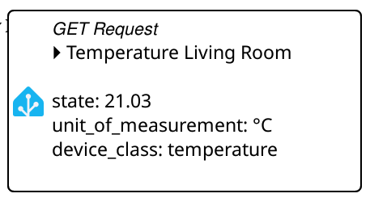

**Finding Available States & Attributes:**

Go to **Home Assistant instance → Developer Tools → States**.  
Select an entity and check the **State** and **Attributes** sections.

> [!NOTE]
> **State Query Limitations:**
>
> * Queries require a single `entity_id`
> * Area and label targeting is not supported
> * Deeply nested JSON attributes may not display cleanly

### Evaluating Templates | 'template'

You can evaluate Home Assistant templates with `homeassistant.koplugin`.  
[Templating](https://www.home-assistant.io/docs/configuration/templating/) can display complex & dynamic information.  
Use them to create conditional messages, going far beyond what **state** offers.  

```lua
{   
    label = "Time, Sun & Lights",
    template = [[
    {{ now().strftime('%Y-%m-%d %H:%M:%S') }}
    Sun: {{ "sun.sun" | state_translated }}
    Lights left on: {{ states.light | selectattr('state', 'eq', 'on') | list | count }}
    ]]
},
```
Be aware of the `template = [[ ]]` syntax.

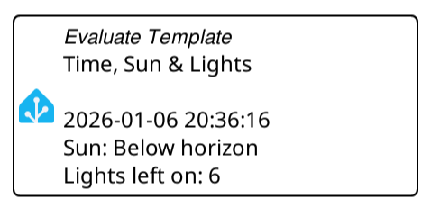

<br>

**How to create and test your templates:**
  
Go to your **Home Assistant instance → Developer Tools → Template**  
Use the [template editor](https://my.home-assistant.io/redirect/developer_template/) to test your code before pasting it into the `template = [[...]]` section of your config.

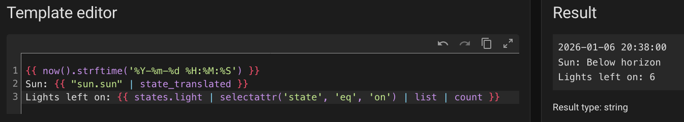

## Examples

### Actions

**Turn off all switches:**

```lua
{
    label = "All Switches: turn_off",
    target = "all",
    action = "switch.turn_off",
},
```

**Play music through Spotify on your Sonos speaker:**

```lua
{
    label = "Play Music",
    action = "media_player.play_media",
    target = "media_player.sonos",
    data = {
        media_content_id = "https://open.spotify.com/album/abcdefghij0123456789YZ",
        media_content_type = "music",
    },
},
```

**Set standing desk height:**

```lua
{
    label = "Set Desk Height to 80cm",
    target = "number.upsy_desky_target_desk_height",
    action = "number.set_value",    
    data = {
        value = 80.0
    },
},
```

**Quit Kodi on a specific device:**

```lua
{
    label = "Quit Kodi",
    target = "media_player.mac_mini",
    action = "kodi.call_method",
    data = {
        method = "Application.Quit"
    },
},
```

**Example YAML to `config.lua` syntax with ALL the data:**

<details>

In theory you can take the whole data part (!) from a Home Assistant YAML action and "convert" it into the Lua syntax required in `config.lua`:

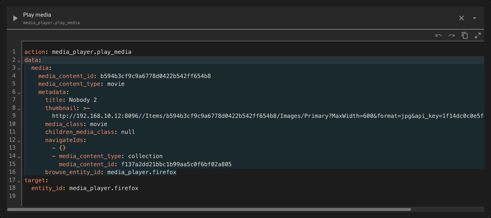

```lua
{
    label = "Play Nobody 2",
    action = "media_player.play_media",
    target = "media_player.firefox",
    data = {
        media = {
            media_content_id = "b594b3cf9c9a6778d0422b542ff654b8",
            media_content_type = "movie",
            metadata = {
                title = "Nobody 2",
                thumbnail = "http://192.168.10.12:8096//Items/b594b3cf9c9a6778d0422b542ff654b8/Images/Primary?MaxWidth=600&format=jpg&api_key=1f14dc0c0e5f4c9597156f186508316e",
                media_class = "movie",
                children_media_class = nil,
                navigateIds = {
                    {},
                    {
                        media_content_type = "collection",
                        media_content_id = "f137a2dd21bbc1b99aa5c0f6bf02a805",
                    },
                },
                browse_entity_id = "media_player.firefox",
            },
        },
    },
},
```

> [!Note]
>   
> This example is intentionally verbose and included for completeness. Most users will never need this level of detail.

</details>

### Templates

**Get information about the currently playing song (as template):**

```lua
{
    label = "Currently Playing",
    template = [[
    
    

    Song: {{ state_attr(player, 'media_title') or '-' }}
    Artist: {{ state_attr(player, 'media_artist') or '-' }}
    Album: {{ state_attr(player, 'media_album_name') or '-' }}
    Length: {{
    (duration // 60) ~ ':' ~ '%02d'|format(duration % 60)
    if duration > 0
    else '-'
    }}
    ]]
},
```

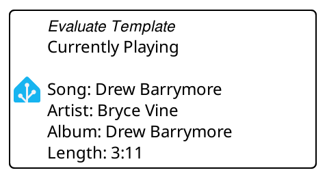

### State Queries

**Get information about the currently playing song:**

```lua
{
    label = "What's playing?",
    target = "media_player.jellyfin_firefox",
    attributes = { "media_title", "media_artist", "media_duration" },
},
```

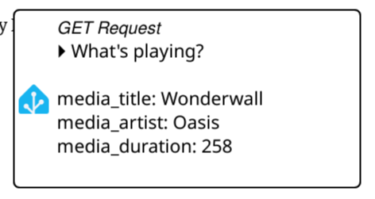

**Check if the light in the shed was left on:**

```lua
{
    label = "Shed Light on?",
    target = "light.shed_ceiling_light",
    attributes = { "state", "brightness", "last_changed" },
},
```

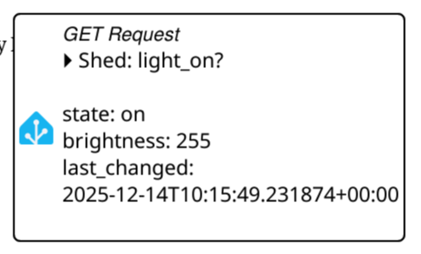

## KOReader Gestures

You can trigger your Home Assistant entities directly through KOReader gestures.  
Each gesture can be assigned to any entity you have configured in `config.lua`.

For any chosen gesture, you will find your entities in:  
**General▸ → Pages 1–X [find your Home Assistant entity]**

The actions will be named after your entity `label`.

A complete gesture example:  
**Settings → Taps and gestures → Gesture manager▸**  
**Long-press on corner▸ → Bottom Left → General▸ → Page 1–X: Toggle: Reading Lamp**

### QuickMenu

The simplest way to access your Home Assistant entities is through a [QuickMenu](https://koreader.rocks/user_guide/#L2-quickmenu).

1) Add as many entities as you want to a gesture (e.g. **Long-press on corner▸ → Bottom Left**)  
2) Select **Show as QuickMenu** in **Long-press on corner▸ → Bottom Left → Page 2**.

Result:

<p align="center">
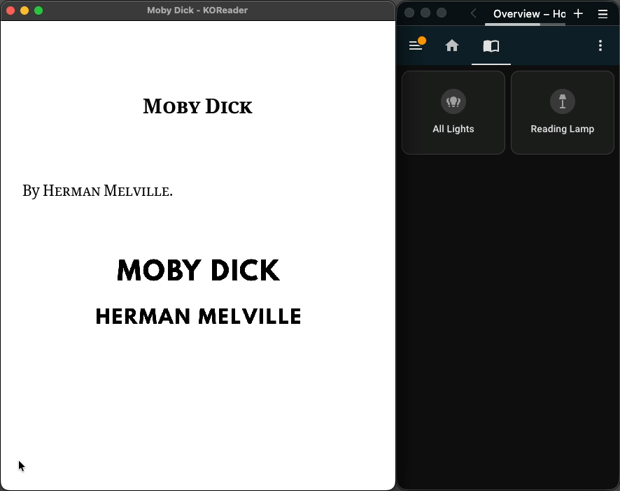
</p>

## Requirements
- KOReader 2024.x or newer (tested with: 2025.10 "Ghost" on a Kindle Basic 2024)  
- Home Assistant instance with a Long-Lived Access Token
- HTTP access to Home Assistant (HTTPS currently not supported - use on local network)

## Screenshots

<p align="center">
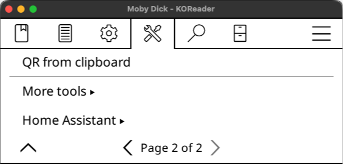
</p>

<p align="center">
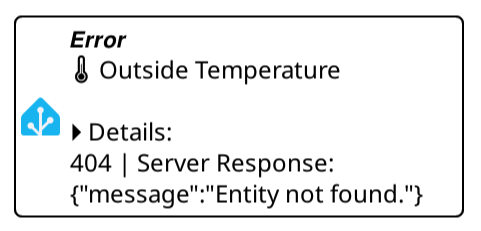
</p>

### Resources:  
[KOReader Website](https://koreader.rocks/)

[Home Assistant: REST API](https://developers.home-assistant.io/docs/api/rest/)  
[Home Assistant: Performing actions](https://www.home-assistant.io/docs/scripts/perform-actions/)  
[Home Assistant: State and state object ](https://www.home-assistant.io/docs/configuration/state_object/)
