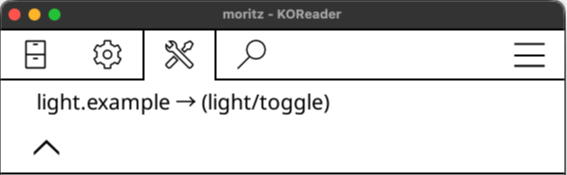
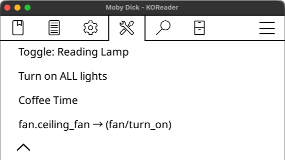
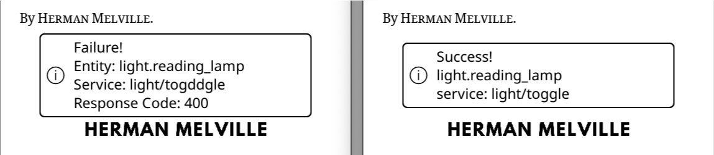

# homeassistant.koplugin

This [KOReader](https://koreader.rocks/) plugin lets you control Home Assistant entities without leaving your current book!

<p align="center">
  Jump to <a href="#getting-started">Getting Started</a>
</p>

<p align="center">

  <i>homeassistant.koplugin: called from Tools menu [left] & as a QuickMenu [right]</i>
</p>

## Features

- Control any number of Home Assistant entities from KOReader 
- Basic service support (e.g. `light/turn_on`, `switch/toggle`, `fan/turn_on`)  
- Lightweight, unobtrusive interface  
- Simple text-based configuration  
- Success/error notifications

<br>

## Getting started
### 1. Download the Plugin

Download the latest release and unpack `homeassistant.koplugin.zip`:  
https://github.com/moritz-john/homeassistant.koplugin/releases

### 2. Edit `config.lua`
#### 2.1 Change Connection Settings

```lua {filename="config.lua"}
-- Home Assistant connection settings
host = "192.168.1.10",  -- Change to your Home Assistant IP Address
port = 8123,            -- Default Home Assistant Port
token =                 -- Change to your own Long-Lived Access Token
"PasteYourHomeAssistantLong-LivedAccessTokenHere",
```

>[!tip] 
> How to create a Long-Lived Access Token:   
> [**Home Assistant**](https://my.home-assistant.io/redirect/profile): *Profile → >Security (scroll down) → Long-lived access tokens → Create token*  
> _Copy the token now - you won’t be able to view it again._

<br>

#### 2.2 Add your own Home Assistant Entities

For each entity you want to control, add an entry with:

```
{
id = "light.example"         → Home Assistant Entity ID
service = "light/toggle"     → Domain-specific service to call
label = "Light Example"      → Optional text label
},
```

>[!important]
> Use the **service** format `light/turn_on`.  
> Do not use automation-style **action** syntax ~~`light.turn_on`~~.

<br>

Example entries for Home Assistant entities in `config.lua`:
```lua
{
    id = "light.reading_lamp",
    service = "light/toggle",   
    label = "Toggle: Reading Lamp",
},
{
    id = "light.all_lights",
    service = "light/turn_on",
    label = "Turn on ALL lights",
},
{
    id = "switch.coffee_machine",
    service = "switch/turn_on",
    label = "Coffee Time",
},
{
    id = "fan.ceiling_fan",
    service = "fan/turn_on",
    label = "",
},
[...]
```
_Be aware of proper indentations, `{}` and `,` otherwise you will get syntax errors_

>[!Tip] 
> If you leave the `label` field empty, the submenu entry for that entity will look like this:  
> `<id> → <(service)>`

<details>
<summary>Screenshot: Empty Label</summary>
<p align="left">

</p>
</details>

<br>

#### Example Actions & Services
Here are common Home Assistant services you can use in `config.lua`:

| Entity Type      | Action Name                                              | Corresponding Service                                          | Example Entity ID          |
| :--------------- | :------------------------------------------------------- | :------------------------------------------------------------- | :------------------------- |
| **Light**        | light.turn_on <br/> light.turn_off <br/> light.toggle    | `light/turn_on` <br/> `light/turn_off` <br/> `light/toggle`    | light.reading_lamp         |
| **Switch**       | switch.turn_on <br/> switch.turn_off <br/> switch.toggle | `switch/turn_on` <br/> `switch/turn_off` <br/> `switch/toggle` | switch.outlet_couch        |
| **Fan**          | fan.turn_on <br/> fan.turn_off <br/> fan.toggle          | `fan/turn_on` <br/> `fan/turn_off` <br/> `fan/toggle`          | fan.ceiling_fan            |
| **Scene**        | scene.turn_on                                            | `scene/turn_on`                                                | scene.reading_mood         |
| **Automation**   | automation.trigger                                       | `automation/trigger`                                           | automation.bed_routine     |
| **Input Button** | input_button.press                                       | `input_button/press`                                           | input_button.wake_computer |
| **Media Player** | media_player.media_play_pause                            | `media_player/media_play_pause`                                |                            |

>[!Note] 
> Only _basic_ services are supported.  
> Additional service data (e.g. `rgb_color`) is not.

<br>

### 3. Copy files
After editing `config.lua` copy the entire `homeassistant.koplugin` folder into `koreader/plugins/`.

### 4. Restart KOReader
The plugin appears under **Tools → Page 2 → Home Assistant**    
or can be called from KOReader gestures.

## Gestures
You can trigger your Home Assistant entities directly through KOReader gestures.  
Each gesture can be assigned to any entity you have configured in `config.lua`.

For any chosen gesture, you will find your entities in  
**General▸ → Pages 1–X [find your Home Assistant entity]**  
The actions will be named after your entity `label`.

A complete gesture example:  
**Settings → Taps and gestures → Gesture manager▸**  
**Long-press on corner▸ → Bottom Left → General▸ → Page 1–X: Toggle: Reading Lamp**

### QuickMenu

The simplest way to access your Home Assistant entities is through a [QuickMenu](https://koreader.rocks/user_guide/#L2-quickmenu).

Add as many entities as you want to a gesture (e.g. **Long-press on corner▸ → Bottom Left**)  
and then select **Show as QuickMenu** in **Long-press on corner▸ → Bottom Left → Page 2**.

The result looks like this:

<p align="center">

</p>

## Requirements
- KOReader (tested with: 2025.10 "Ghost" on a Kindle Basic 2024)  
- Home Assistant & a Long-Lived Access Token
- HTTP access (HTTPS currently not supported)

## Screenshots

<p align="center">

</p>

<p align="center">

</p>

<p align="center">

</p>

[homeassistant.koplugin Repository](https://github.com/moritz-john/homeassistant.koplugin)  
[KOReader Website](https://koreader.rocks/)

[Home Assistant: REST API](https://developers.home-assistant.io/docs/api/rest/)  
[Home Assistant: Services](https://data.home-assistant.io/docs/services/)  
[Home Assistant: Performing actions](https://www.home-assistant.io/docs/scripts/perform-actions/)


